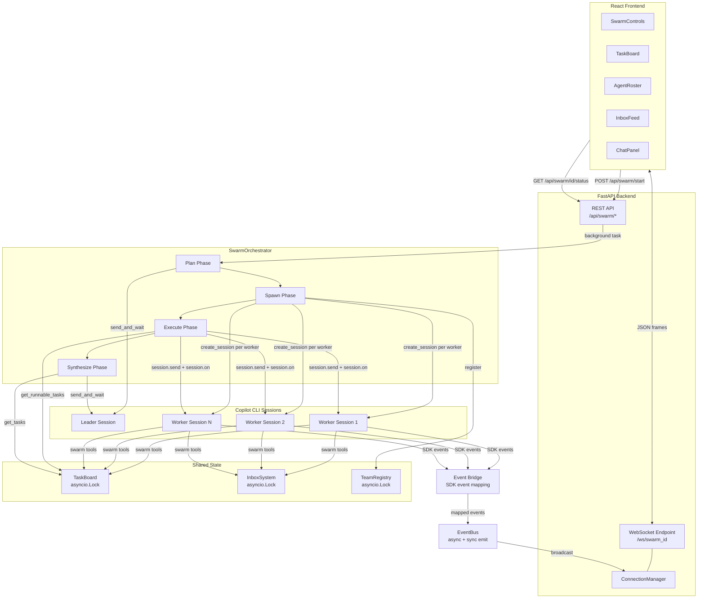

# Architecture Overview

This system implements a multi-agent swarm pattern on top of the Copilot CLI SDK. A leader session decomposes a user goal into a dependency graph of tasks, spawns one headless Copilot CLI session per worker agent, and executes tasks concurrently across rounds. A FastAPI backend exposes REST endpoints for swarm lifecycle management and a WebSocket endpoint for real-time event streaming to a React frontend. All coordination between agents happens through shared, lock-protected data structures (TaskBoard, InboxSystem, TeamRegistry) rather than direct inter-process communication.

## Component Diagram



## Component Descriptions

### SwarmOrchestrator

The orchestrator drives the four-phase swarm lifecycle. In the **plan** phase, it creates a leader session and asks it to decompose the user goal into a JSON task graph with dependency edges. In the **spawn** phase, it creates one `SwarmAgent` per unique worker name in the plan, each backed by its own Copilot CLI session. The **execute** phase runs rounds: each round queries the TaskBoard for runnable (unblocked) tasks, assigns at most one task per worker, and executes all assignments concurrently via `asyncio.gather`. The **synthesize** phase creates a fresh session that reads all task results and produces a final report. The orchestrator supports cancellation at any point between rounds.

### SwarmAgent

Each SwarmAgent wraps a single Copilot CLI session configured with `custom_agents` (providing agent identity without replacing the system message) and four closure-captured swarm tools. Task execution is event-driven: the agent calls `session.send()` to begin work, then subscribes to session events via `session.on()` with a handler that sets an `asyncio.Event` on `ASSISTANT_TURN_END` or `SESSION_ERROR`. The agent waits on that event with a configurable timeout. SDK events are forwarded to the EventBus through `_on_event`. The `finally` block always calls `unsubscribe()` to prevent listener leaks.

### TaskBoard

The TaskBoard manages tasks with dependency resolution. Each task has a `blocked_by` list of prerequisite task IDs. When a task is added with non-empty `blocked_by`, it starts in `BLOCKED` status. When a task completes, `_resolve_dependencies` removes its ID from every other task's `blocked_by` list; tasks whose list becomes empty transition from `BLOCKED` to `PENDING`. All mutations are protected by a single `asyncio.Lock`. The orchestrator calls `get_runnable_tasks()` each round to find `PENDING` tasks ready for execution.

### InboxSystem

The InboxSystem provides point-to-point and broadcast messaging between agents. `send()` delivers a timestamped message to a specific recipient's inbox. `broadcast()` delivers to all registered agents except the sender and an optional exclusion list. `receive()` performs a destructive read, returning and clearing all messages for an agent. `peek()` provides non-destructive inspection. All operations are protected by an `asyncio.Lock`. Agents access the inbox through the `inbox_send` and `inbox_receive` swarm tools.

### TeamRegistry

The TeamRegistry tracks metadata for all spawned agents, including name, role, display name, status (`idle`, `working`, `done`, `error`), and a `tasks_completed` counter. The orchestrator registers agents during the spawn phase. Status updates and counter increments are exposed as async methods, all guarded by an `asyncio.Lock`.

### EventBus

The EventBus is a publish-subscribe hub that decouples event producers from consumers. `subscribe()` returns an unsubscribe callable. `emit()` delivers events to all subscribers from async contexts, catching and logging individual subscriber errors so one failure does not block others. `emit_sync()` bridges synchronous SDK callbacks into the async world by scheduling `emit()` on the event loop via `call_soon_threadsafe`. The WebSocket forwarder subscribes during app lifespan startup and broadcasts events to connected clients grouped by swarm ID.

### Event Bridge

The `bridge_sdk_event` function maps the 14 `SessionEventType` variants (representing ~70 distinct SDK event shapes) into a normalized WebSocket event taxonomy (`agent.status_changed`, `agent.message_delta`, `agent.message`, `agent.tool_call`, `agent.tool_result`, `agent.error`, etc.). It handles the **tool_requests one-step-off pattern**: when an `assistant.message` event carries both content and `tool_requests`, the content is suppressed (it will be superseded by tool output) and an `agent.message_finalize` event is emitted instead. Messages with content but no tool requests emit `agent.message` normally. Messages with neither are suppressed entirely.

### Swarm Tools

The `create_swarm_tools` factory produces four tools that close over the agent name, TaskBoard, and InboxSystem: **task_update** (transition a task's status and optionally record a result), **inbox_send** (send a message to another agent), **inbox_receive** (destructive read of the agent's inbox), and **task_list** (list tasks, optionally filtered by owner). All tools set `skip_permission=True` to avoid interactive approval prompts in headless mode. The closure pattern ensures each agent's tools operate with the correct identity without global state.

## Key Design Decisions

- **One session per worker**: Each worker agent gets its own Copilot CLI session, enabling true concurrent execution via `asyncio.gather` rather than sequential turns on a shared session.
- **`custom_agents` config instead of system message replacement**: Agent identity (name, role, description) is injected through the SDK's `custom_agents` parameter, preserving the default system prompt and its capabilities.
- **Event-driven execution instead of `send_and_wait`**: Workers use `session.send()` + `session.on()` with an `asyncio.Event` rather than blocking `send_and_wait()`, allowing SDK events to stream in real time to the frontend while the agent works.
- **`asyncio.Lock` on all shared state**: TaskBoard, InboxSystem, and TeamRegistry each hold a single `asyncio.Lock` protecting all mutations, preventing race conditions when multiple workers complete tasks or send messages simultaneously.
- **Closure-captured tools**: Swarm tools capture `agent_name`, `task_board`, and `inbox` via closures at creation time, avoiding global mutable state and ensuring each agent's tool calls are correctly attributed.
- **Round-based execution with dependency resolution**: The orchestrator runs discrete rounds rather than free-running execution, giving a natural point to resolve dependencies, check cancellation, and emit progress events.

## Directory Layout

```
src/
  backend/
    main.py                  # FastAPI app, lifespan, WebSocket endpoint
    events.py                # EventBus (async/sync pub-sub)
    config.py                # Application configuration
    api/
      rest.py                # REST endpoints: start, status, cancel, templates
      schemas.py             # Pydantic request/response models
      websocket.py           # ConnectionManager (per-swarm WS connections)
    swarm/
      orchestrator.py        # SwarmOrchestrator (plan/spawn/execute/synthesize)
      agent.py               # SwarmAgent (event-driven session wrapper)
      task_board.py           # TaskBoard (dependency resolution, async-safe)
      inbox_system.py         # InboxSystem (point-to-point + broadcast)
      team_registry.py        # TeamRegistry (agent metadata tracking)
      tools.py                # Swarm tool factory (4 closure-captured tools)
      event_bridge.py         # SDK-to-WebSocket event mapping
      models.py               # Data models (Task, AgentInfo, InboxMessage)
      prompts.py              # System prompts (leader, synthesis)
      templates.py            # Goal templates
  frontend/
    index.html
    vite.config.ts
    tsconfig.json
    src/
      main.tsx               # App entry point
      App.tsx                 # Root component
      types/
        swarm.ts             # TypeScript types (SwarmState, SwarmEvent, Task, AgentInfo)
      hooks/
        useSwarmState.ts     # Reducer for swarm state from WebSocket events
        useWebSocket.ts      # WebSocket connection with exponential backoff reconnect
      components/
        SwarmControls.tsx    # Goal input, template selection, start/cancel
        TaskBoard.tsx        # Task dependency visualization
        AgentRoster.tsx      # Agent status display
        InboxFeed.tsx        # Inter-agent message feed
        ChatPanel.tsx        # Agent output streaming
```
