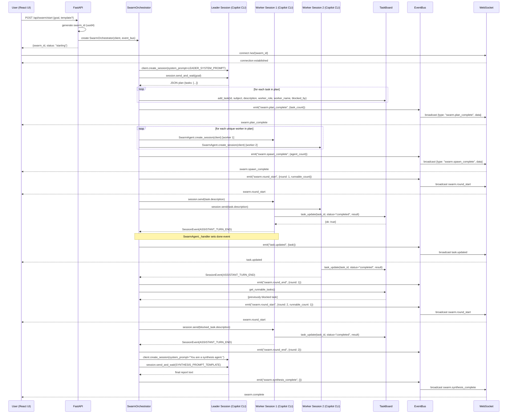
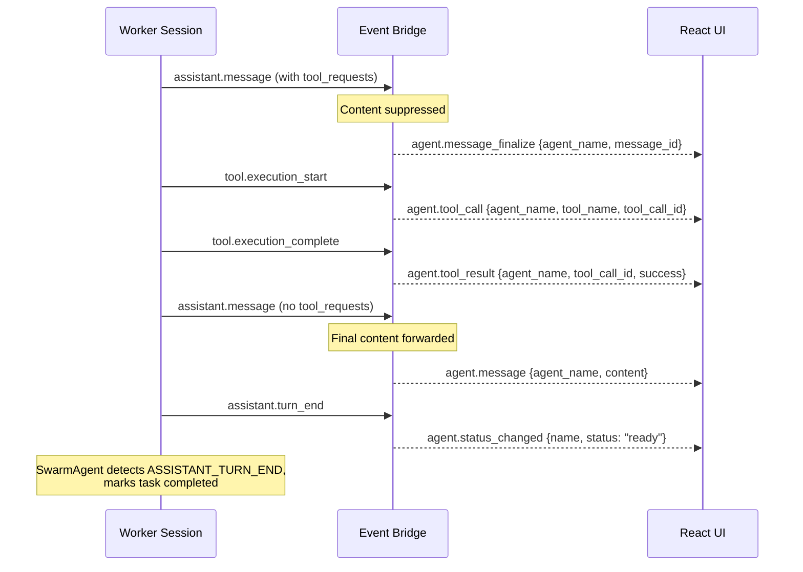

# Communication Flow

## Overview

The swarm system consists of seven principal actors that communicate through a layered event-driven architecture. The **React UI** initiates swarm runs via REST calls to **FastAPI**, which creates a **SwarmOrchestrator** and returns a `swarm_id`. The UI then opens a **WebSocket** connection to receive real-time updates. The orchestrator manages the full lifecycle by delegating planning and synthesis to a **Leader Session** (a Copilot CLI process) and distributing work to one or more **Worker Sessions** (also Copilot CLI processes). Workers mutate shared state on the **TaskBoard** through tool calls, while all significant state transitions flow through the **EventBus**, a publish-subscribe bus that bridges backend events to the WebSocket layer and ultimately to the UI.

## Full Swarm Lifecycle

## Event Flow Detail: The `tool_requests` One-Step-Off Pattern

When a Copilot CLI session processes a task, the assistant often responds with a message that contains both text content and `tool_requests`. The SDK emits an `assistant.message` event for this response, but the content at this point is not the final answer -- it is intermediate reasoning before the tool executes. Only after the tool completes and the assistant responds again (this time without `tool_requests`) does the message contain the actual final content.

The `bridge_sdk_event` function in `event_bridge.py` handles this by splitting `assistant.message` into two cases:

1. **`assistant.message` WITH `tool_requests`**: The content is suppressed (not forwarded to the UI). Instead, an `agent.message_finalize` event is emitted, signaling that the agent is about to execute tools.
2. **`assistant.message` WITHOUT `tool_requests`**: The content is the final output. An `agent.message` event is emitted with the full content, which the UI renders as the agent's response.

This prevents the UI from displaying stale intermediate text that would be immediately superseded by the post-tool response.

## WebSocket Event Taxonomy

The following table lists all event types emitted over the WebSocket, their source, and data shape.

### Orchestrator Events

These are emitted directly by `SwarmOrchestrator` and `TaskBoard` through the `EventBus`.

| Event Type | Description | Data Shape |
|---|---|---|
| `swarm.plan_complete` | Leader finished decomposing the goal into tasks | `{ task_count: number }` |
| `swarm.spawn_complete` | All worker sessions have been created | `{ agent_count: number }` |
| `swarm.round_start` | A new execution round is beginning | `{ round: number, runnable_count: number }` |
| `swarm.round_end` | An execution round has finished | `{ round: number }` |
| `swarm.synthesis_complete` | Leader finished producing the final report | `{}` |
| `swarm.error` | The swarm encountered a fatal error | `{ message: string }` |
| `swarm.cancelled` | The swarm was cancelled by the user | `{}` |
| `swarm.task_failed` | A specific task failed during execution | `{ task_id: string, agent: string, error: string }` |

### Agent Events (via Event Bridge)

These are produced by `bridge_sdk_event` in `event_bridge.py`, which maps raw Copilot SDK `SessionEvent` types to the WebSocket taxonomy.

| Event Type | SDK Source | Description | Data Shape |
|---|---|---|---|
| `agent.status_changed` | `assistant.turn_start` | Agent began thinking | `{ name: string, status: "thinking" }` |
| `agent.status_changed` | `assistant.turn_end` | Agent finished its turn | `{ name: string, status: "ready" }` |
| `agent.status_changed` | `subagent.started` | Sub-agent is working | `{ name: string, status: "working" }` |
| `agent.status_changed` | `subagent.completed` | Sub-agent finished | `{ name: string, status: "idle" }` |
| `agent.reasoning_delta` | `assistant.reasoning_delta` | Streaming reasoning token | `{ agent_name: string, reasoning_id: string, delta: string }` |
| `agent.reasoning` | `assistant.reasoning` | Complete reasoning block | `{ agent_name: string, reasoning_id: string, content: string }` |
| `agent.message_delta` | `assistant.message_delta` | Streaming message token | `{ agent_name: string, delta: string, message_id: string }` |
| `agent.message` | `assistant.message` (no tool_requests) | Final message content from agent | `{ agent_name: string, content: string }` |
| `agent.message_finalize` | `assistant.message` (with tool_requests) | Intermediate message suppressed; tools pending | `{ agent_name: string, message_id: string }` |
| `agent.tool_call` | `tool.execution_start` | Agent is invoking a tool | `{ agent_name: string, tool_name: string, tool_call_id: string }` |
| `agent.tool_output` | `tool.execution_partial_result` | Partial output from a running tool | `{ agent_name: string, tool_call_id: string, output: string }` |
| `agent.tool_result` | `tool.execution_complete` | Tool execution finished | `{ agent_name: string, tool_call_id: string, success: boolean }` |
| `agent.usage` | `assistant.usage` | Token usage statistics | `{ agent_name: string, usage: object }` |
| `agent.error` | `subagent.failed` or `session.error` | Agent or session error | `{ name: string, error: string }` |

### Frontend Reducer Events

The `useSwarmState` reducer additionally handles these event types, which may be emitted by higher-level orchestration logic or future extensions:

| Event Type | Description | State Effect |
|---|---|---|
| `swarm.phase_changed` | Swarm phase transition | Sets `phase` |
| `task.created` | A new task was added | Appends to `tasks` |
| `task.updated` | A task changed status or result | Updates matching task in `tasks` |
| `agent.spawned` | A new agent was registered | Appends to `agents` |
| `inbox.message` | An inter-agent message was sent | Appends to `messages` |
| `leader.plan` | Leader's raw plan text | Sets `leaderPlan` |
| `leader.report` | Leader's synthesis report | Sets `leaderReport` |
| `round.started` | Alias for `swarm.round_start` | Sets `roundNumber` |
| `swarm.complete` | Swarm run finished successfully | Sets `phase` to `"complete"` |
| `swarm.error` | Swarm run failed | Sets `error` |
