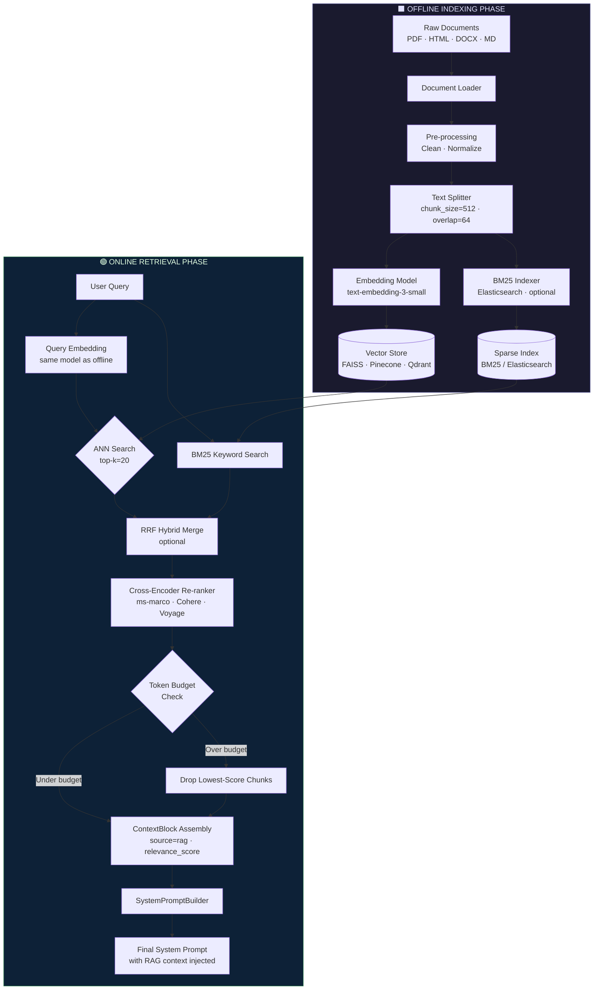
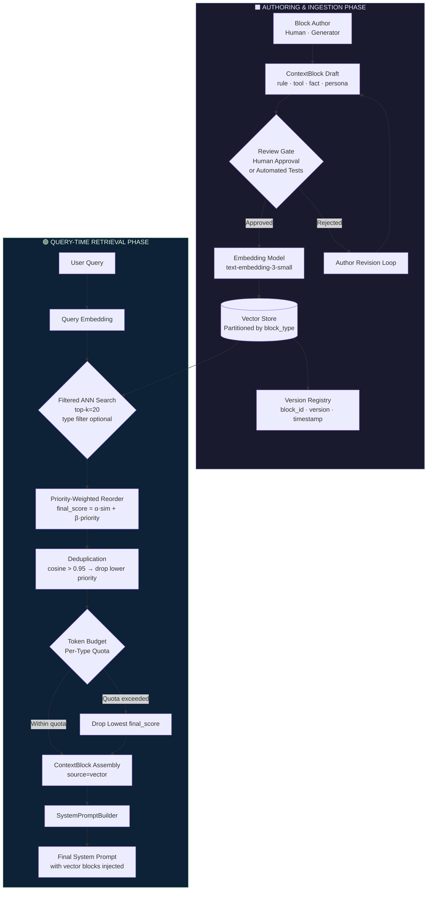
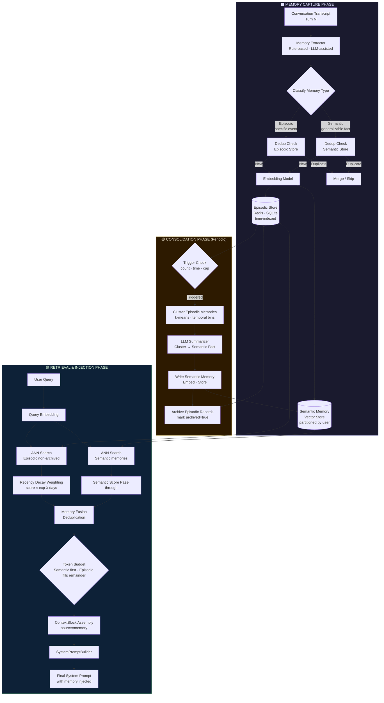
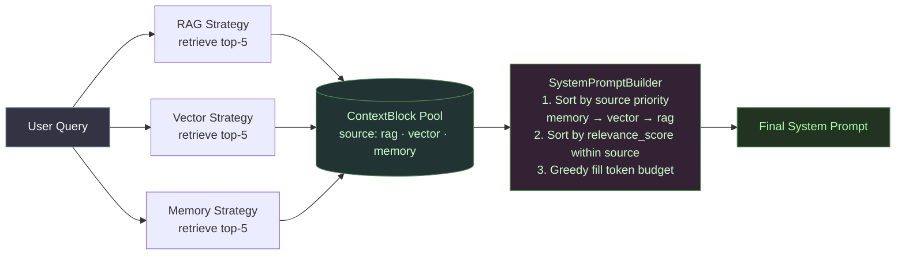
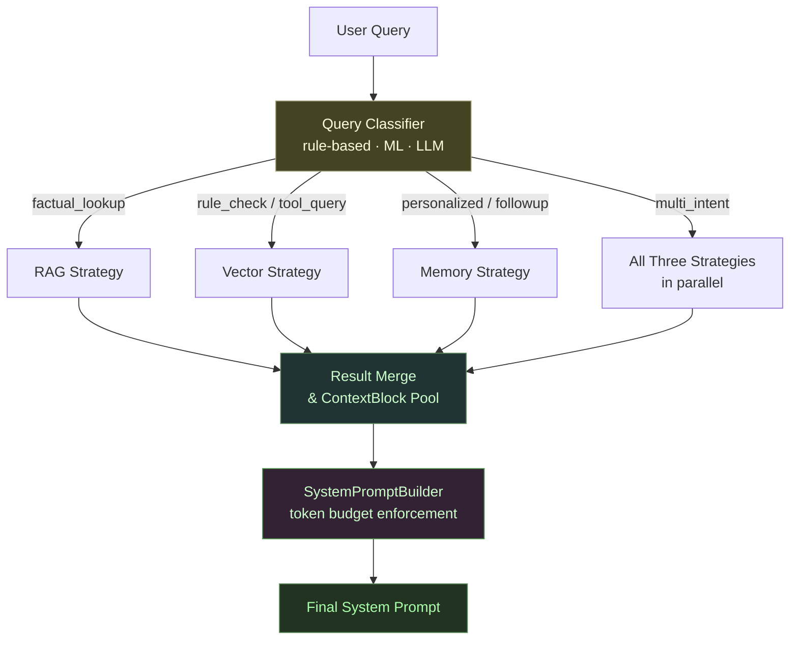
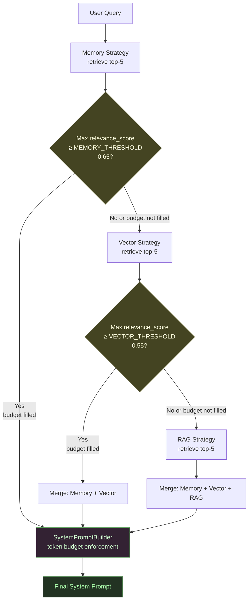
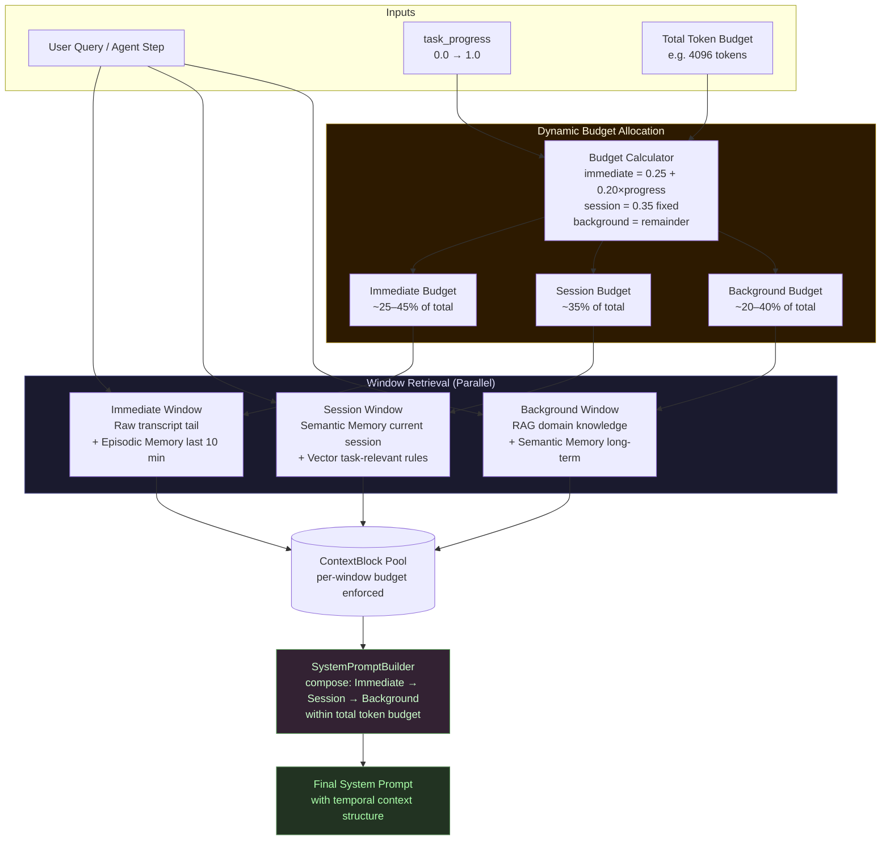

# System Prompt Pre-Fill Strategies: Design Document

**Version:** 1.0  
**Status:** Final Draft  
**Audience:** Implementers, Testers, Documenters  
**Repository:** `copilot-sdk-multi-agent-swarm`

---

## Table of Contents

1. [Terminology Glossary](#section-1-terminology-glossary)
2. [RAG Pre-fill — Deep Dive](#section-2-rag-pre-fill--deep-dive)
3. [Vector-based Pre-fill — Deep Dive](#section-3-vector-based-pre-fill--deep-dive)
4. [Memory-based Pre-fill — Deep Dive](#section-4-memory-based-pre-fill--deep-dive)
5. [Comparison Matrix](#section-5-comparison-matrix)
6. [Shared Data Model Interfaces](#section-6-shared-data-model-interfaces)
7. [Hybrid Composition Patterns](#section-7-hybrid-composition-patterns)

---

## Section 1: Terminology Glossary

All terms below are used consistently throughout this document. Implementers and testers must treat these definitions as authoritative.

| Term | Definition |
|------|------------|
| **System Prompt** | The initial, non-user-visible instruction block prepended to an LLM conversation. It shapes model behavior, persona, constraints, and context for the entire session. In most APIs this corresponds to the `system` role message. |
| **Pre-fill** | The act of populating the system prompt (or a designated prefix of the conversation context) with dynamically retrieved or generated content *before* the LLM processes the user's query. Pre-fill is distinct from fine-tuning: it operates at inference time without modifying model weights. |
| **Context Injection** | The specific sub-operation of inserting one or more `ContextBlock` objects into the system prompt at a defined position. Injection respects a token budget and ordering policy. |
| **Embedding** | A fixed-length dense vector (e.g., 1536 dimensions for `text-embedding-ada-002`) produced by an embedding model that encodes the semantic meaning of a text fragment. Two texts with similar meanings will have embeddings with high cosine similarity. |
| **Vector Store** | A specialized database optimized for storing and querying high-dimensional embedding vectors. Provides ANN (Approximate Nearest Neighbor) search as its primary query primitive. Examples: FAISS, Pinecone, Weaviate, Qdrant. |
| **ANN Search** | Approximate Nearest Neighbor search — an algorithm that retrieves the *k* vectors most similar to a query vector in sub-linear time, trading a small accuracy loss for large speed gains. Algorithms include HNSW, IVF, and PQ. |
| **Chunking** | The process of splitting a large document into smaller, self-contained text segments (chunks) that fit within embedding model token limits and maximize retrieval precision. Common strategies: fixed-size with overlap, sentence-boundary, semantic paragraph, recursive. |
| **Memory Consolidation** | The offline or periodic process of compressing many raw episodic memories into a smaller set of higher-level semantic summaries, reducing token pressure while preserving salient information. Analogous to human long-term memory formation during sleep. |
| **Token Budget** | A hard upper limit (measured in tokens) on the total content that may be injected into the system prompt. Exceeding this budget causes context window overflow or degrades generation quality. All retrieval strategies must respect this budget. |
| **Semantic Similarity** | A numerical measure (typically cosine similarity in [−1, 1]) of how closely related two text fragments are in meaning, computed from their embeddings. Higher values indicate greater topical or conceptual overlap. |
| **Episodic Memory** | A memory type that captures *specific events* with temporal context: who said what, when, in which session. Episodic memories are raw, granular, and time-stamped. Example: "User asked about their account renewal on 2024-11-02." |
| **Semantic Memory** | A memory type that captures *generalized facts or patterns* derived from multiple episodes, without per-event timestamps. Example: "User prefers concise bullet-point answers and has a background in ML engineering." |

---

## Section 2: RAG Pre-fill — Deep Dive

### 2.1 Conceptual Explanation

Retrieval-Augmented Generation (RAG) pre-fill treats the system prompt as a *knowledge injection point*. Instead of relying solely on what the LLM learned during training, RAG extends the model's effective knowledge base by retrieving the most relevant passages from an external document corpus and placing them directly into the system prompt before the model generates a response.

The core insight is that LLMs are excellent at *reasoning over provided context* even when they lack that knowledge intrinsically. RAG exploits this by acting as a dynamic librarian: given the user's query, it finds the right pages of the right books and hands them to the model.

RAG is the correct strategy when:
- The knowledge base changes frequently (product docs, legal regulations, internal wikis).
- Answers require verbatim or near-verbatim grounding in source documents.
- Hallucination risk on factual claims must be minimized.
- Document provenance and citation are required.

### 2.2 Technical Pipeline

#### Phase 1 — Offline Indexing

This phase runs once at ingestion time and is re-run whenever the corpus changes.

| Step | Operation | Detail |
|------|-----------|--------|
| **1** | **Document Loading** | Ingest raw files (PDF, HTML, DOCX, Markdown, plaintext) via document loaders (LangChain `DocumentLoader`, LlamaIndex `Reader`, or custom parsers). Output: list of `(raw_text, source_uri, metadata)` tuples. |
| **2** | **Pre-processing** | Strip boilerplate (headers, footers, nav menus), normalize whitespace, detect language, apply any domain-specific cleaning rules. |
| **3** | **Chunking** | Split each document into chunks using a text splitter. Recommended: recursive character splitter with `chunk_size=512 tokens`, `chunk_overlap=64 tokens`. Record `chunk_index`, `parent_doc_id`, and `page_number` in metadata. |
| **4** | **Embedding** | Pass each chunk through an embedding model (e.g., `text-embedding-3-small`, `sentence-transformers/all-MiniLM-L6-v2`, or a self-hosted BGE model). Output: one vector per chunk. |
| **5** | **Vector Store Upsert** | Write each `(chunk_id, embedding_vector, chunk_text, metadata)` record into the vector store. Configure HNSW index parameters (`M=16`, `ef_construction=200`) for balanced speed/recall. |
| **6** | **BM25 Index (optional)** | For hybrid retrieval, also index chunk text in a sparse BM25 index (e.g., Elasticsearch or BM25Okapi). Used for keyword-exact recall that dense search can miss. |

#### Phase 2 — Online Retrieval (At Inference Time)

| Step | Operation | Detail |
|------|-----------|--------|
| **1** | **Query Embedding** | Embed the user's query using the *same* embedding model used at index time. |
| **2** | **ANN Search** | Query the vector store for the top-`k` (e.g., `k=20`) most similar chunks by cosine similarity. |
| **3** | **Hybrid Merge (optional)** | If BM25 is enabled, retrieve top-`k` BM25 results and merge with dense results using Reciprocal Rank Fusion (RRF). |
| **4** | **Re-ranking** | Pass the merged candidate set through a cross-encoder re-ranker (e.g., `cross-encoder/ms-marco-MiniLM-L-12-v2`, Cohere Rerank, or Voyage Rerank). Re-rankers score each `(query, chunk)` pair jointly, far more accurately than bi-encoder similarity. Select top-`n` (e.g., `n=5`) highest-scoring chunks. |
| **5** | **Token Budget Check** | Sum token counts of selected chunks. If total exceeds the allocated RAG token budget, drop the lowest-scoring chunks until the budget is met. |
| **6** | **Context Injection** | Format surviving chunks as `ContextBlock` objects and pass them to `SystemPromptBuilder`. Each block is prefixed with its source URI for traceability. |

### 2.3 Architecture Diagram



---

## Section 3: Vector-based Pre-fill — Deep Dive

### 3.1 Conceptual Explanation

Vector-based pre-fill is frequently confused with RAG because both use embeddings and vector stores. The distinction is fundamental:

| Dimension | RAG Pre-fill | Vector-based Pre-fill |
|-----------|-------------|----------------------|
| **Unit of storage** | Chunks of prose documents (paragraphs, pages) | Discrete, authored *context blocks* (facts, rules, tool specs, persona snippets) |
| **Content origin** | Raw corpus of unstructured documents | Manually or programmatically curated structured entries |
| **Purpose** | Inject domain knowledge / grounding | Inject behavioral rules, capability descriptions, structured facts |
| **Authoring model** | Ingest-and-forget (automated pipeline) | Deliberate authoring with review gates |

Think of vector-based pre-fill as a *semantic configuration layer*. A team curates a library of context blocks — things like "When the user asks about billing, apply these 3 rules," or "Tool X accepts these parameters and returns this schema" — and the system selects the most relevant blocks for each query via ANN search. The blocks are short, precise, and purpose-built, unlike the long organic text chunks that RAG retrieves.

Vector-based pre-fill is the correct strategy when:
- You need deterministic behavioral rules or policy enforcement.
- Tool/function descriptions must be surfaced only when relevant (reducing prompt clutter).
- Persona or tone adjustments depend on detected user intent.
- The context library is small enough to be fully human-reviewed.

### 3.2 Technical Pipeline

#### Phase 1 — Authoring and Ingestion

| Step | Operation | Detail |
|------|-----------|--------|
| **1** | **Block Authoring** | A human author (or a structured generation pipeline) creates `ContextBlock` records: a short text (≤200 tokens), a type tag (`rule`, `tool_description`, `fact`, `persona`, `constraint`), a priority weight, and freeform metadata. |
| **2** | **Review Gate** | Blocks pass through a mandatory review step (human approval or automated test suite) before being admitted to the live store. This preserves precision and prevents drift. |
| **3** | **Embedding** | Each block's `content` is embedded via the same embedding model used at query time. The embedding captures semantic intent, enabling future retrieval against query embeddings. |
| **4** | **Vector Store Upsert** | The `(block_id, embedding, content, type, priority_weight, metadata)` tuple is written to the vector store. Namespace/partition by block type to enable filtered search. |
| **5** | **Versioning** | Each block carries a `version` field. Updates create new records (new `block_id`) rather than overwriting, enabling rollback and audit trails. |

#### Phase 2 — Query-time Retrieval

| Step | Operation | Detail |
|------|-----------|--------|
| **1** | **Query Embedding** | Embed the user's query. |
| **2** | **Filtered ANN Search** | Query the vector store with optional type filters (e.g., retrieve only `rule` and `tool_description` blocks). Top-`k` = 10–30 depending on block density. |
| **3** | **Priority-weighted Reordering** | Re-sort results by: `final_score = α × semantic_similarity + (1-α) × priority_weight`, where `α` ∈ [0.6, 0.9] is a tunable parameter. High-priority blocks (e.g., safety constraints) are boosted even if semantic similarity is moderate. |
| **4** | **Deduplication** | Remove blocks that are semantically redundant (cosine similarity > 0.95 between selected blocks). Keep the higher-priority one. |
| **5** | **Token Budget Enforcement** | Allocate token budget per type (e.g., 300 tokens for `rule`, 200 for `tool_description`, 100 for `persona`). Fill greedily by type quota. |
| **6** | **Context Injection** | Assemble surviving blocks as `ContextBlock` objects with `source="vector"` and pass to `SystemPromptBuilder`. |

### 3.3 Architecture Diagram



---

## Section 4: Memory-based Pre-fill — Deep Dive

### 4.1 Conceptual Explanation

Memory-based pre-fill gives an LLM application *continuity across sessions*. While RAG retrieves from a static document corpus and vector pre-fill retrieves authored rules, memory retrieval draws from the *history of interactions with a specific user or agent*.

Two memory types must be maintained separately:

**Episodic Memory** records specific events: "In session #47, the user mentioned their company uses Kubernetes on GKE." These are raw, timestamped, and granular. They accumulate rapidly and must be periodically consolidated to avoid unbounded growth.

**Semantic Memory** captures distilled generalizations: "The user is a senior DevOps engineer at a mid-size SaaS company who prefers CLI examples over GUI walkthroughs." These are written by the consolidation process (or an LLM summarizer) and are stable over time.

The two types serve different injection purposes:
- Episodic memories surface *recent, specific context* that would be lost between sessions.
- Semantic memories surface *durable user model facts* that improve every response.

Memory-based pre-fill is the correct strategy when:
- The application serves returning users over multiple sessions.
- Personalization materially improves response quality or user satisfaction.
- The system must avoid asking users to repeat themselves.
- Agent continuity (remembering past decisions, commitments, tool states) is required.

Technologies in this space: **MemGPT** (hierarchical memory management), **LangMem** (LangChain memory layer), **Zep** (open-source memory store with temporal reasoning), and custom stores built on SQLite + Redis + a vector index.

### 4.2 Technical Pipeline

#### Phase 1 — Memory Capture

| Step | Operation | Detail |
|------|-----------|--------|
| **1** | **Turn Extraction** | At the end of each conversation turn (or session), a memory extractor reads the transcript and identifies memory-worthy fragments: facts stated by the user, preferences expressed, errors corrected, commitments made. |
| **2** | **Memory Classification** | Classify each fragment as `episodic` (specific event, time-bound) or `semantic` (generalizable fact). This can be rule-based or LLM-assisted (a cheap classifier call). |
| **3** | **Deduplication Check** | Before writing, query the memory store for near-duplicate memories (cosine similarity > 0.92). If a duplicate exists, either skip the new memory or merge it (update the existing record's timestamp and confidence). |
| **4** | **Memory Embedding** | Embed the memory content. |
| **5** | **Write to Memory Store** | Write `(memory_id, content, type, user_id, session_id, timestamp, embedding, tags, confidence_score)` to the appropriate store: episodic memories to a time-indexed store (Redis sorted set or SQLite with timestamp index), semantic memories to a vector store partition. |

#### Phase 2 — Consolidation (Periodic / Triggered)

| Step | Operation | Detail |
|------|-----------|--------|
| **1** | **Trigger** | Consolidation is triggered when: episodic memory count exceeds threshold (e.g., > 100 per user), time since last consolidation exceeds window (e.g., 7 days), or memory store size approaches a per-user cap. |
| **2** | **Cluster Episodic Memories** | Group episodic memories by topic or temporal proximity using a lightweight clustering algorithm (k-means on embeddings, or temporal binning). |
| **3** | **LLM Summarization** | Feed each cluster to an LLM with a summarization prompt: "Summarize the following interaction fragments into a single semantic memory fact. Be concise and specific." |
| **4** | **Write Semantic Memories** | Write the LLM-generated summaries as new semantic memory records. Embed them. |
| **5** | **Archive Episodic** | Mark consolidated episodic memories as `archived` (do not delete — maintain audit trail). Archived memories are excluded from future retrieval unless explicitly requested. |

#### Phase 3 — Retrieval and Injection (At Inference Time)

| Step | Operation | Detail |
|------|-----------|--------|
| **1** | **Dual-Store Query** | Embed the user's current query. Query both episodic (non-archived, for this user) and semantic memory partitions in parallel. Top-`k` = 5 from each. |
| **2** | **Recency Weighting** | Apply recency decay to episodic results: `score = semantic_similarity × exp(-λ × days_since_creation)`, where `λ` ≈ 0.05. Recent episodes score higher than old ones with equal semantic match. |
| **3** | **Memory Fusion** | Merge episodic and semantic results. Apply deduplication (if a semantic memory covers the same content as an episodic one, prefer the semantic). |
| **4** | **Token Budget Enforcement** | Semantic memories are injected first (stable, high-value). Episodic memories fill remaining budget in recency-weighted order. |
| **5** | **Context Injection** | Assemble surviving memories as `ContextBlock` objects with `source="memory"` and pass to `SystemPromptBuilder`. |

### 4.3 Architecture Diagram



---

## Section 5: Comparison Matrix

| Dimension | RAG Pre-fill | Vector-based Pre-fill | Memory-based Pre-fill |
|-----------|-------------|----------------------|----------------------|
| **Retrieval Mechanism** | Dense ANN + optional BM25 hybrid; cross-encoder re-ranking | Dense ANN with type-filtered partitions; priority-weighted reorder | Dual-store ANN (episodic + semantic); recency-decay scoring |
| **Storage Backend** | Vector store (FAISS, Pinecone, Qdrant) + optional sparse index (Elasticsearch) | Vector store with namespace partitions per block type; version registry | Vector store (semantic partition) + time-indexed key-value store (Redis/SQLite) for episodic |
| **Latency Impact (query time)** | **Medium-High**: embedding + ANN + optional BM25 + re-ranker adds ~50–300 ms depending on re-ranker model size | **Low-Medium**: embedding + filtered ANN + lightweight reorder adds ~20–80 ms; no heavy re-ranker needed | **Medium**: parallel dual-store query + recency decay adds ~30–100 ms; consolidation runs offline |
| **Freshness / Staleness Risk** | **Medium**: corpus is fresh only when re-indexed; stale if documents update between ingestion runs. Mitigation: incremental indexing with change detection. | **Low**: blocks are authored explicitly and versioned. Staleness is a governance failure, not a pipeline failure. | **Low (episodic) / Medium (semantic)**: episodic memories are near-real-time. Semantic memories are stale until next consolidation cycle. |
| **Compute Cost** | **High**: embedding all corpus chunks at ingest; cross-encoder re-ranking at query time is GPU-intensive | **Low**: small block library means low embedding cost at ingest; no re-ranker needed | **Medium**: per-turn extraction adds cost; LLM-assisted consolidation is periodic batch cost; query-time cost is low |
| **Data Authoring Effort** | **Low**: ingest raw documents with minimal curation. Pipeline handles splitting and embedding automatically. | **High**: every block must be deliberately authored, reviewed, and versioned. Quality is fully authoring-dependent. | **Low (episodic)**: captured automatically from conversation. **Medium (semantic)**: consolidation requires LLM prompt tuning and quality monitoring. |
| **Scalability Ceiling** | **Very High**: corpus can scale to millions of documents with distributed vector stores and async indexing pipelines | **Medium**: library of authored blocks is naturally bounded by author capacity. Typically 100s–10,000s of blocks, rarely beyond. | **High per-user**: scales linearly with user count. Per-user memory store is small; horizontal sharding by user_id is straightforward. |
| **Best Use Case Profile** | Knowledge-grounded QA, document search, regulatory compliance, citation-required responses, internal knowledge bases | Policy enforcement, tool routing, capability description injection, persona selection, rule-based behavioral control | Personalized assistants, long-running agents, multi-session user support, commitment tracking, preference-aware responses |

---

## Section 6: Shared Data Model Interfaces

All three strategies share a common type system. Implementers **must** use these abstractions as the interface boundary between retrieval logic and prompt construction logic. Do not pass raw strings between retrieval and prompt-building layers.

### 6.1 Core Data Types

```python
from __future__ import annotations
from abc import ABC, abstractmethod
from dataclasses import dataclass, field
from datetime import datetime
from typing import Literal


@dataclass
class ContextBlock:
    """
    A single unit of retrieved context ready for injection into a system prompt.
    All three retrieval strategies produce lists of ContextBlock.
    """
    id: str
    # The human-readable text content to inject. Must not exceed token_count tokens.
    content: str
    # Which strategy produced this block. Drives priority ordering in SystemPromptBuilder.
    source: Literal["rag", "vector", "memory"]
    # Normalized score in [0.0, 1.0]. Meaning is source-dependent:
    #   rag    → cross-encoder re-rank score
    #   vector → final_score = α·cosine + β·priority_weight
    #   memory → recency-decayed cosine similarity
    relevance_score: float
    # Pre-computed token count of `content`. Used by SystemPromptBuilder for budget tracking.
    # Compute with: len(tokenizer.encode(content))
    token_count: int
    # Arbitrary key-value metadata. Required keys by source:
    #   rag    → {"source_uri": str, "chunk_index": int, "parent_doc_id": str}
    #   vector → {"block_type": str, "version": str, "priority_weight": float}
    #   memory → {"memory_type": "episodic"|"semantic", "user_id": str, "timestamp": str}
    metadata: dict = field(default_factory=dict)
```

### 6.2 Retrieval Strategy Interface

```python
class RetrievalStrategy(ABC):
    """
    Abstract base for all three retrieval strategy implementations.
    Each implementation (RAGStrategy, VectorStrategy, MemoryStrategy) must
    satisfy this interface exactly. The SystemPromptBuilder depends only on
    this interface — it must never import concrete strategy classes.
    """

    @abstractmethod
    def retrieve(
        self,
        query: str,
        top_k: int,
        token_budget: int,
    ) -> list[ContextBlock]:
        """
        Retrieve the most relevant ContextBlocks for the given query.

        Args:
            query:        The user's input query text (raw, un-embedded).
            top_k:        Maximum number of ContextBlocks to return.
                          Implementations may return fewer if token_budget
                          is exhausted before top_k is reached.
            token_budget: Hard upper limit on the sum of token_count across
                          all returned blocks. Implementations MUST enforce
                          this: sum(b.token_count for b in result) <= token_budget.

        Returns:
            List of ContextBlock, ordered by relevance_score descending.
            Empty list if no results meet the minimum relevance threshold.
        """
        ...

    @abstractmethod
    def index(self, documents: list[str]) -> None:
        """
        Index (or re-index) a list of document strings into the strategy's
        backing store.

        For RAGStrategy:    Chunk, embed, and upsert all documents.
        For VectorStrategy: Embed and upsert authored context block strings.
        For MemoryStrategy: This method is not the primary ingestion path
                            (use MemoryStore.add_memory instead). Calling
                            index() on a MemoryStrategy triggers a full
                            re-embedding of all non-archived memories.

        This method is idempotent: re-indexing the same document string must
        produce the same result as the initial index call (content-hash dedup
        is the responsibility of the implementation).
        """
        ...
```

### 6.3 Memory Store Interface

```python
class MemoryStore(ABC):
    """
    Specialized interface for memory-based pre-fill backends.
    Manages the full lifecycle: capture → consolidation → retrieval.
    Implementations: ZepMemoryStore, LangMemStore, SQLiteRedisMemoryStore.
    """

    @abstractmethod
    def add_memory(
        self,
        content: str,
        timestamp: datetime,
        tags: list[str],
    ) -> str:
        """
        Capture and store a new memory fragment.

        Args:
            content:   The text of the memory. Should be a single, self-contained
                       fact or event description (≤200 tokens recommended).
            timestamp: The wall-clock time the memory was observed. Used for
                       recency decay scoring at retrieval time.
            tags:      Free-form classification tags. Required tags:
                       - "type:episodic" or "type:semantic"
                       - "user_id:<id>"
                       - "session_id:<id>"

        Returns:
            memory_id: A stable unique identifier for the stored memory.
                       Callers may use this to update or archive specific
                       memories later.
        """
        ...

    @abstractmethod
    def retrieve_memories(
        self,
        query: str,
        top_k: int,
    ) -> list[ContextBlock]:
        """
        Retrieve the most relevant memories for the given query.
        Implementations must query BOTH episodic and semantic partitions
        in parallel, apply recency decay to episodic results, fuse and
        deduplicate the merged result, then return top_k ContextBlocks
        with source="memory".

        The caller (SystemPromptBuilder) is responsible for token budget
        enforcement on the returned list.
        """
        ...

    @abstractmethod
    def consolidate(self) -> None:
        """
        Run the memory consolidation pipeline:
        1. Load all non-archived episodic memories for all users.
        2. Cluster by topic/temporal proximity.
        3. For each cluster, call an LLM summarizer to produce a semantic
           memory string.
        4. Write new semantic memory records (via add_memory with
           "type:semantic" tag).
        5. Mark consolidated episodic memories as archived=True.

        This method is designed for periodic batch execution (cron, Celery
        beat, or a triggered workflow). It must be idempotent: calling it
        twice on the same data must not produce duplicate semantic memories
        (use content-hash dedup on generated summaries).
        """
        ...
```

### 6.4 System Prompt Builder

```python
class SystemPromptBuilder:
    """
    Assembles the final system prompt from a base template and a list of
    ContextBlocks. This class is the single point of control for token
    budget enforcement, ordering policy, and prompt formatting.
    """

    # Source-based priority order. Lower index = higher priority.
    # When token budget is tight, higher-priority sources are retained first.
    SOURCE_PRIORITY: list[str] = ["memory", "vector", "rag"]

    def build(
        self,
        base_prompt: str,
        blocks: list[ContextBlock],
        token_budget: int,
    ) -> str:
        """
        Build the final system prompt string.

        Token Budget Enforcement Algorithm:
        ─────────────────────────────────
        1. Count tokens in base_prompt. If base_prompt alone exceeds
           token_budget, raise PromptBudgetExceededError — the base
           prompt is non-negotiable.

        2. remaining_budget = token_budget - base_prompt_token_count

        3. Sort blocks by SOURCE_PRIORITY (memory first), then by
           relevance_score descending within each source group.

        4. Greedy fill: iterate sorted blocks. Add each block if
           block.token_count <= remaining_budget. Subtract
           block.token_count from remaining_budget. Skip (do NOT
           truncate content) blocks that don't fit.
           Rationale: partial context blocks mislead the model more
           than omitting them entirely.

        5. Assemble prompt sections in priority order:
             [BASE PROMPT]
             ---
             [MEMORY CONTEXT]
             <memory blocks, one per paragraph>
             ---
             [BEHAVIORAL CONTEXT]
             <vector blocks, grouped by block_type>
             ---
             [KNOWLEDGE CONTEXT]
             <rag blocks, each prefixed with source_uri>
             ---

        6. Return the assembled string. Total token count must satisfy:
           sum(token_count) <= token_budget (verified by assertion in
           non-production builds).

        Args:
            base_prompt:  The static system prompt template. May contain
                          {placeholders} for dynamic values, but those must
                          be resolved BEFORE calling build().
            blocks:       All ContextBlocks from all retrieval strategies,
                          combined into a single flat list. build() handles
                          sorting and budget enforcement internally.
            token_budget: Hard upper bound on total system prompt tokens.
                          Typical values: 2048 (tight), 4096 (standard),
                          8192 (large-context models).

        Returns:
            The fully assembled system prompt string, guaranteed to fit
            within token_budget.

        Raises:
            PromptBudgetExceededError: If base_prompt alone exceeds budget.
        """
        ...
```

### 6.5 Token Budget Enforcement — Key Decisions

| Decision | Chosen Policy | Rationale |
|----------|--------------|-----------|
| **Truncation vs. omission** | Omit blocks that don't fit; never truncate mid-block | Truncated context blocks produce worse model behavior than no context block |
| **Priority source order** | `memory` > `vector` > `rag` | Memory personalizes (highest user impact); vector enforces rules (safety-critical); RAG adds knowledge (nice-to-have) |
| **Base prompt protection** | Raise error if base prompt exceeds budget | The base prompt is the behavioral backbone; silently truncating it is worse than failing loudly |
| **Within-source ordering** | `relevance_score` descending | Best-matching blocks are retained when budget runs out |
| **Budget accounting unit** | Tokens (not characters) | Token counts are what the LLM API enforces; character-based budgeting introduces unpredictable overflows |

---

## Section 7: Hybrid Composition Patterns

The three strategies are not mutually exclusive. This section defines four integration patterns that combine them to address complex real-world requirements. Each pattern is described, diagrammed, and mapped to its ideal use case.

---

### Pattern 1: Layered Priority Stack

#### Description

All three strategies run concurrently at query time. Their results are pooled into a single flat list of `ContextBlock` objects and passed to `SystemPromptBuilder`, which enforces the `memory > vector > rag` priority ordering and greedy token budget fill described in Section 6.

This is the simplest and most general hybrid pattern. It imposes no routing logic and requires no classifier — the token budget itself acts as the selector. When the budget is generous, all three layers contribute. When it is tight, the priority ordering ensures that personalization (memory) and behavioral rules (vector) are never sacrificed for raw knowledge (RAG).

#### Ideal Use Case

General-purpose conversational assistants with a large knowledge base, user-specific preferences, and behavioral policies that must coexist. Example: an enterprise support bot that must follow compliance rules (vector), personalize to the user's role (memory), and answer from product documentation (RAG).

#### Mermaid Diagram



---

### Pattern 2: Query-Routing Ensemble

#### Description

A lightweight classifier analyzes the user's query *before* any retrieval occurs and routes to one or more strategies. Routing reduces latency (avoid calling all three strategies every time) and prevents irrelevant context from polluting the prompt.

The classifier can be:
- **Rule-based**: regex / keyword matching for high-confidence query types.
- **ML-based**: a small fine-tuned classifier (e.g., `distilbert` or a zero-shot `text-classification` pipeline).
- **LLM-based**: a cheap, fast LLM call with a structured output schema.

Query type → Strategy mapping:
| Query Type | Strategies Invoked |
|-----------|-------------------|
| Factual / knowledge lookup | RAG |
| Rule check / policy question | Vector |
| Personalized / preference-sensitive | Memory |
| Tool invocation / capability question | Vector |
| Conversational / follow-up | Memory + (Vector if tool-related) |
| Complex / multi-intent | All three |

#### Ideal Use Case

High-traffic applications where query-time latency is budget-constrained and queries are typed (factual vs. conversational vs. procedural are clearly distinguishable). Example: a coding assistant that routes "how do I do X" to RAG (docs), "what tools do you have" to Vector (tool descriptions), and "last time you helped me with Y" to Memory.

#### Mermaid Diagram



---

### Pattern 3: Cascading Fallback

#### Description

Strategies are invoked sequentially in priority order (Memory → Vector → RAG). Each strategy's result set is evaluated against a minimum relevance threshold. If the results are below the threshold, the next strategy is invoked to *augment* the context. The cascade stops as soon as the token budget is filled or all strategies have been tried.

This pattern is latency-optimal when the most common case (memory hit) satisfies the token budget without needing downstream strategies. It degrades gracefully: a new user with no memory history will fall through to vector rules and then to RAG knowledge, each filling the gap left by the previous tier.

**Threshold configuration** (tunable per deployment):
- `MEMORY_RELEVANCE_THRESHOLD` = 0.65 (fall through to Vector if top memory score < 0.65)
- `VECTOR_RELEVANCE_THRESHOLD` = 0.55 (fall through to RAG if top vector score < 0.55)

#### Ideal Use Case

Multi-session assistants with a heterogeneous user base (some returning users with rich memory, some first-time users). The cascade naturally adapts: power users get memory-first personalization; new users get rules and knowledge without the overhead of empty memory queries dominating latency.

#### Mermaid Diagram



---

### Pattern 4: Temporal Context Windowing

#### Description

This pattern is purpose-designed for **long-running agent tasks** (multi-step workflows, autonomous agents, research tasks that span hours or days). It recognizes that context relevance is not just semantic — it is also *temporal*.

The pattern divides the token budget into three temporal windows:

| Window | Source | Description |
|--------|--------|-------------|
| **Immediate Window** | Raw transcript + Episodic Memory (last 10 minutes) | What just happened. Most recent turns and fresh episodic memories. Highest-priority. |
| **Session Window** | Semantic Memory (current session) + Vector (task-relevant rules) | What matters for this task. The session's accumulated semantic understanding plus the behavioral rules relevant to the current step. |
| **Background Window** | RAG (domain knowledge) + Semantic Memory (long-term) | What the agent knows about the world. Domain knowledge and long-term user model. Lowest priority, first to be dropped when budget tightens. |

Each window has a *fractional budget allocation* (e.g., 40% Immediate / 35% Session / 25% Background). Allocations are dynamically adjusted based on how far into the task the agent is: early-task allocations favor Background (orientation); late-task allocations favor Immediate (execution precision).

**Dynamic budget formula:**
```
task_progress ∈ [0.0, 1.0]  (0 = start, 1 = final step)

immediate_fraction = 0.25 + 0.20 × task_progress
session_fraction   = 0.35  (fixed)
background_fraction = 1.0 - immediate_fraction - session_fraction
```

At `task_progress=0.0`: 25% / 35% / 40%  
At `task_progress=1.0`: 45% / 35% / 20%

#### Ideal Use Case

Long-horizon autonomous agents executing multi-step plans: code generation agents, research agents, workflow orchestrators. The pattern prevents the agent from losing sight of what just happened (Immediate) while retaining both behavioral constraints (Session) and domain knowledge (Background).

#### Mermaid Diagram



---

## Appendix A: Technology Reference

| Technology | Category | Notes |
|-----------|----------|-------|
| FAISS | Vector Store (local) | Facebook AI. In-process, no server required. HNSW and IVF indexes. Best for ≤10M vectors. |
| Pinecone | Vector Store (managed) | Fully managed, horizontal scaling, metadata filtering, serverless tier available. |
| Weaviate | Vector Store (self-hosted/cloud) | Schema-based objects, hybrid BM25+dense, GraphQL query API. |
| Qdrant | Vector Store (self-hosted/cloud) | Rust-based, rich filtering, named vectors, excellent Rust/Python clients. |
| Elasticsearch | Sparse Index | BM25 natively; also supports dense vector fields (kNN). Hybrid retrieval in v8.x+. |
| LangChain | Orchestration | Document loaders, text splitters, retrieval chains, memory integrations. |
| LlamaIndex | Orchestration | Node/index/query engine abstractions, strong RAG focus, storage-agnostic. |
| MemGPT | Memory System | Hierarchical memory with main context and external storage, LLM-driven paging. |
| LangMem | Memory System | LangChain-native memory layer; episodic + semantic; pluggable backends. |
| Zep | Memory System | Open-source, temporal graph memory, session management, REST API. |
| Cohere Rerank | Re-ranker | Hosted cross-encoder re-ranking API; strong multilingual support. |
| BGE-Reranker | Re-ranker | Open-source, self-hostable cross-encoder; `BAAI/bge-reranker-large`. |
| text-embedding-3-small | Embedding | OpenAI; 1536 dims; strong multilingual; cost-effective. |
| all-MiniLM-L6-v2 | Embedding | Sentence-Transformers; 384 dims; fast; good for local/edge deployments. |

---

## Appendix B: Failure Modes and Mitigations

| Failure Mode | Affected Strategy | Mitigation |
|-------------|------------------|------------|
| Stale corpus / outdated RAG chunks | RAG | Incremental indexing with content-hash change detection; add `indexed_at` timestamp to metadata; alert on corpus age |
| Embedding model drift (model swap) | All | Pin embedding model version; re-embed entire corpus when model changes; version embeddings in metadata |
| Memory pollution (hallucinated facts stored as memories) | Memory | Confidence scoring at capture time; human review flag for low-confidence memories; consolidation LLM validates summaries |
| Token budget overflow (base_prompt too large) | All | Enforce `PromptBudgetExceededError`; instrument base prompt token count; alert at 80% threshold |
| ANN recall degradation (index not rebuilt) | All | Monitor recall@k via canary queries against brute-force ground truth; trigger index rebuild when recall drops below threshold |
| Irrelevant blocks injected (low relevance_score passing through) | All | Set minimum `relevance_score` threshold per strategy (RAG ≥ 0.45, Vector ≥ 0.50, Memory ≥ 0.40); drop blocks below threshold regardless of budget |
| Cross-user memory leakage | Memory | Enforce `user_id` partition isolation at the vector store level (namespace per user); never pass `user_id` from untrusted input |
