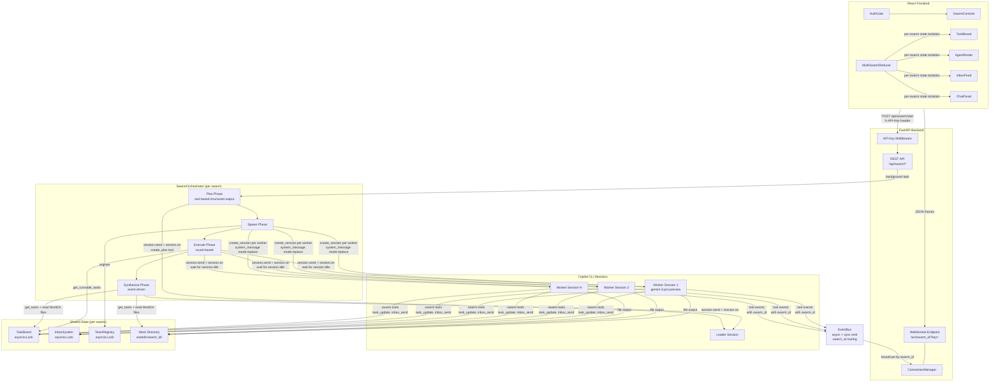

# Architecture Overview

This system implements a multi-agent swarm pattern on top of the Copilot CLI SDK. A leader session decomposes a user goal into a dependency graph of tasks, spawns one headless Copilot CLI session per worker agent, and executes tasks concurrently across rounds. A FastAPI backend exposes REST endpoints for swarm lifecycle management and a WebSocket endpoint for real-time event streaming to a React frontend. All coordination between agents happens through shared, lock-protected data structures (TaskBoard, InboxSystem, TeamRegistry) rather than direct inter-process communication. Multiple swarms run concurrently with isolated state and per-swarm event routing.

## Component Diagram

## Component Descriptions

### SwarmOrchestrator

The orchestrator drives the four-phase swarm lifecycle. Each orchestrator instance has a `swarm_id` — all events emitted via `_emit()` are tagged with it for per-swarm routing.

In the **plan** phase, it creates a leader session and sends the goal. The leader calls `create_plan` (a Pydantic-schema tool) to submit a structured plan — no JSON parsing from text. In the **spawn** phase, it creates one `SwarmAgent` per unique worker name, each configured with `system_message: mode:"replace"` (no `customAgents` — empirically proven to suppress tool compliance). The **execute** phase runs rounds: each round queries the TaskBoard for runnable tasks, assigns at most one per worker, emits `agent.status_changed` with `"working"`, and executes all assignments via `asyncio.gather`. The **synthesize** phase creates a session that receives all task results plus the contents of all `.md` files from the work directory, then produces a final report via event-driven text capture.

The orchestrator creates `workdir/<swarm_id>/` at the start of `run()` and passes the path to all agents via their system prompt.

### SwarmAgent

Each SwarmAgent wraps a single Copilot CLI session configured with `system_message: {mode: "replace", content: full_prompt}` and four closure-captured swarm tools. The full prompt is assembled from three layers: system preamble (coordination protocol from `system-prompt.md`), work directory directive, and template prompt (domain expertise).

Task execution is event-driven: the agent calls `session.send()` with the task ID and description, then subscribes to events via `session.on()`. A handler sets an `asyncio.Event` on `session.idle` (not `turn_end` — agents do multiple turns per task). The agent captures text from `assistant.message` and `assistant.reasoning` events as fallback results. Tool events are forwarded to the EventBus with `swarm_id` attached.

### Tool Handlers

The `create_swarm_tools` factory produces four tools with defensive error handling:

- **task_update** — Validates `task_id` and `status` fields exist, returns error result (not crash) for malformed args. Emits `task.updated` with full task dict for real-time frontend updates.
- **inbox_send** — Validates `to` and `message` fields. Includes ISO timestamp in event payload.
- **inbox_receive** — No required params. Returns messages with timestamps.
- **task_list** — Optional `owner` filter. Handles `None` arguments gracefully.

All handlers wrap in try/except, log actual arguments on failure via structlog, and return `ToolResult` with `result_type="error"` instead of raising.

### TaskBoard

Manages tasks with dependency resolution. Each task has a `blocked_by` list. When a task completes, `_resolve_dependencies` removes its ID from downstream tasks; tasks with empty `blocked_by` transition from `BLOCKED` to `PENDING`. All mutations protected by `asyncio.Lock`.

### InboxSystem

Point-to-point messaging between agents. `send()` delivers a timestamped message. `receive()` performs destructive read. The system prompt instructs agents to call `inbox_receive` once (not poll) to prevent runaway loops.

### EventBus

Publish-subscribe hub with both `emit()` (async) and `emit_sync()` (bridges synchronous SDK callbacks). The WebSocket forwarder subscribes during app lifespan and routes events by `swarm_id`. Events without `swarm_id` broadcast to all connections.

### Multi-Swarm Frontend

The frontend maintains a `MultiSwarmStore` with per-swarm `SwarmState` keyed by `swarm_id`:

- `multiSwarmReducer` routes events to the correct swarm's state via `swarm.event` actions
- `SwarmConnection` components (one per active swarm) each own a `useWebSocket` hook
- `useWebSocket` includes an `active` guard to prevent duplicate events from React Strict Mode's double-invoke
- Dashboard merges all swarms' data via `flatMap` with composite React keys (`swarm_id-task.id`)
- Completed swarms move from `activeSwarmIds` to `completedSwarmIds` (WS disconnects, data retained)
- Hard cap of 10 swarms with auto-eviction of oldest completed

### Authentication

API key middleware (`verify_api_key`) checks `X-API-Key` header on REST endpoints. WebSocket endpoint checks `?key=` query param. Auth behavior depends on `ENVIRONMENT`:

- `development` + no key = auth disabled
- Any other environment + no key = 500 error (forces configuration)
- Key set in any environment = auth enforced

### Swarm Lifecycle Management (Saga)

The orchestrator supports suspend/resume across restarts:

- **Phase persistence**: `service.update_phase()` called at every transition (planning, spawning, executing, synthesizing, complete, suspended). Stored in Postgres `swarms.phase` column.
- **Round tracking**: `service.update_round()` called each execution round. Stored in `swarms.current_round`.
- **Pause on exhaustion**: After `_execute()`, if actionable tasks remain (PENDING/BLOCKED/IN_PROGRESS), the orchestrator pauses via `asyncio.Event` with a 30-minute auto-suspend timeout. User can Continue (run more rounds), Skip to synthesis, or let it auto-suspend.
- **Crash recovery**: On startup, `recover_orphaned_swarms()` scans for swarms in non-terminal phases (executing, planning, spawning) and transitions them to `suspended`.
- **Cold resume**: `POST /api/swarm/{id}/resume` rebuilds the orchestrator from DB: `SwarmService.load()` hydrates TaskBoard + TeamRegistry, `_rebuild_agents()` recreates SwarmAgent instances with `_configure_agent()` applying template config (max_retries, disabled_skills, mcp_servers), and `_execute()` resumes.

### Automatic Task Retry

When a task fails (circuit breaker or exception), the orchestrator checks the agent's retry budget:
- Per-task retry counter (not per-agent) — each task gets its own budget
- `maxRetries` configurable at template level (default 2) with per-worker override in frontmatter
- Retry uses `agent.resume_session()` to preserve full conversation history, then sends a nudge message with failure context
- Post-execution status check — if `execute_task()` sets FAILED/TIMEOUT without raising, the retry loop detects it

### MCP Server (Swarm State)

In-process FastMCP server mounted at `/mcp` on the FastAPI app. Provides 9 tools for agent self-awareness:

| Tool | Description |
|------|-------------|
| `get_active_swarms` | List all swarms with IDs, phase, goal |
| `get_swarm_status` | Phase, round, agent count, task counts |
| `list_tasks` | All tasks with optional status/worker filter |
| `get_task_detail` | Full task including result |
| `get_recent_events` | Event history (requires DB) |
| `list_agents` | Agent roster with status |
| `list_artifacts` | Files in work directory |
| `read_artifact` | Read a specific file (path traversal protected) |
| `resume_agent` | Resume a failed agent's session |

All tools require `swarm_id` (except `get_active_swarms`) for multi-swarm isolation. Auth via `X-API-Key` header at transport layer — invisible to agent context.

### SwarmService (Cache-First Persistence)

`SwarmService` owns the in-memory cache (TaskBoard, InboxSystem, TeamRegistry) and optional write-through to `SwarmRepository`:
- Reads from cache, writes to cache + repo (if configured)
- `load(swarm_id)` hydrates cache from Postgres for cold-start resume
- `suspend(reason)` persists suspended state
- `update_round(n)` persists round progress

## Key Design Decisions

- **`system_message: mode:"replace"` instead of `customAgents`**: Empirically proven across 8 models that `customAgents` suppresses custom tool compliance. Direct system message replacement works reliably with Gemini 3 Pro Preview.
- **`session.idle` instead of `turn_end`**: Agents do multiple turns per task. `turn_end` fires per-turn; `session.idle` fires when truly done.
- **Event-driven synthesis instead of `send_and_wait`**: `send_and_wait` times out at 300s but the CLI keeps working. Event-driven pattern captures the response regardless of timing.
- **Per-swarm `_emit()` helper**: All orchestrator events go through `_emit()` which attaches `swarm_id`. Prevents accidental broadcast events.
- **Defensive tool handlers**: SDK catches handler exceptions and returns opaque "Tool execution failed". Our try/except returns helpful error messages the agent can act on.
- **Work directory per swarm**: Agents write files to `workdir/<swarm_id>/`. Synthesis reads all `.md` files from this directory to get full research content, not just task_update summaries.
- **Credit/debit prompt architecture**: System preamble (mandatory coordination protocol) is separated from template prompts (domain expertise). This separation of concerns means template authors can't accidentally remove tool mandates.
