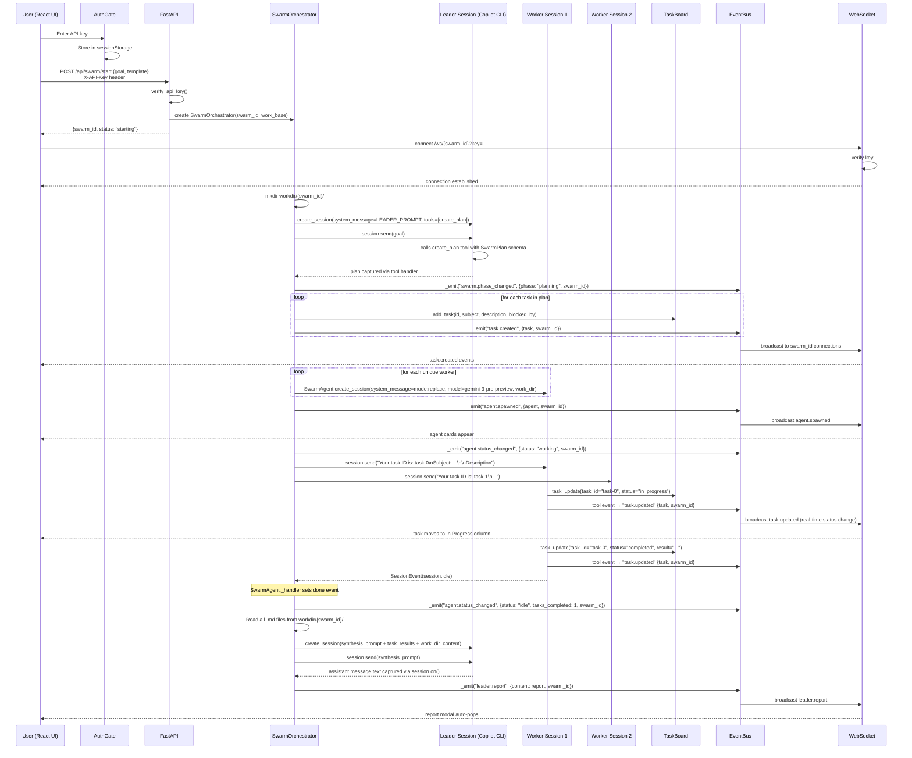

# Communication Flow

## Overview

The swarm system communicates through a layered event-driven architecture with per-swarm routing. The **React UI** initiates swarm runs via authenticated REST calls to **FastAPI**, which creates a **SwarmOrchestrator** and returns a `swarm_id`. The UI opens a **WebSocket** connection (with API key) to receive real-time updates scoped to that swarm. The orchestrator manages the full lifecycle by delegating planning to a **Leader Session** (via tool-based structured output) and distributing work to **Worker Sessions** (event-driven, waiting for `session.idle`). Workers mutate shared state on the **TaskBoard** through defensive tool handlers, while all state transitions flow through the **EventBus** tagged with `swarm_id` for per-swarm routing.

## Full Swarm Lifecycle

## Event Routing

All events carry `swarm_id`. The WebSocket forwarder in `main.py` uses `data.get("swarm_id")` (non-destructive) to route events to the correct WS connections via `ConnectionManager.broadcast(swarm_id, ...)`.

The frontend's `SwarmConnection` component tags each incoming WS event with the `swarmId` from the connection URL, then dispatches to the `multiSwarmReducer` which routes to the correct per-swarm state.

## WebSocket Event Taxonomy

### Orchestrator Events

Emitted by `SwarmOrchestrator._emit()` — all include `swarm_id`.

| Event Type | Description | Data Shape |
| --- | --- | --- |
| `swarm.phase_changed` | Phase transition | `{ phase, swarm_id }` |
| `swarm.plan_complete` | Leader finished task decomposition | `{ task_count, swarm_id }` |
| `swarm.spawn_complete` | All worker sessions created | `{ agent_count, swarm_id }` |
| `swarm.round_start` | Execution round beginning | `{ round, runnable_count, swarm_id }` |
| `swarm.round_end` | Execution round finished | `{ round, swarm_id }` |
| `swarm.synthesis_complete` | Final report produced | `{ swarm_id }` |
| `swarm.error` | Fatal error | `{ message, swarm_id }` |
| `swarm.cancelled` | User cancelled | `{ swarm_id }` |
| `swarm.task_failed` | Task execution failed | `{ task_id, agent, error, swarm_id }` |
| `swarm.rounds_exhausted` | Max rounds reached with tasks remaining | `{ remaining_tasks, max_rounds, swarm_id }` |
| `swarm.suspended` | Swarm paused awaiting user decision | `{ remaining_tasks, max_rounds, reason, swarm_id }` |

### Task and Agent Events

| Event Type | Source | Description | Data Shape |
| --- | --- | --- | --- |
| `task.created` | Orchestrator plan phase | New task added to board | `{ task: {id, subject, status, ...}, swarm_id }` |
| `task.updated` | Tool handler + orchestrator | Task status/result changed | `{ task: {id, status, result, ...}, swarm_id }` |
| `agent.spawned` | Orchestrator spawn phase | New agent registered | `{ agent: {name, role, display_name, status, tasks_completed}, swarm_id }` |
| `agent.status_changed` | Orchestrator execute phase | Agent working/idle/failed | `{ agent_name, status, tasks_completed?, swarm_id }` |
| `agent.resumed` | Orchestrator resume_agent | Agent session resumed after failure | `{ agent_name, swarm_id }` |
| `inbox.message` | Tool handler (inbox_send) | Inter-agent message | `{ sender, recipient, content, timestamp, swarm_id }` |
| `leader.plan` | Orchestrator plan phase | Raw plan text | `{ content, swarm_id }` |
| `leader.report` | Orchestrator synthesis phase | Final report | `{ content, swarm_id }` |

### Frontend Reducer Events

The `multiSwarmReducer` handles routing; the inner `swarmReducer` handles these per-swarm:

| Event Type | State Effect |
| --- | --- |
| `swarm.phase_changed` | Sets `phase` |
| `task.created` | Appends to `tasks` with `swarm_id` from event data |
| `task.updated` | Updates matching task by `id` |
| `agent.spawned` | Appends to `agents` with `swarm_id` from event data |
| `agent.status_changed` | Updates agent status and `tasks_completed` |
| `inbox.message` | Appends to `messages` with `swarm_id` from event data |
| `leader.report` | Sets `leaderReport` |
| `round.started` / `swarm.round_start` | Sets `roundNumber` |
| `swarm.complete` | Sets `phase` to `"complete"` |
| `swarm.error` | Sets `error` |
| `swarm.suspended` | Sets `phase` to `"suspended"`, stores pause metadata |

### Multi-Swarm Store Actions

| Action Type | Effect |
| --- | --- |
| `swarm.add` | Creates new per-swarm state, adds to `activeSwarmIds` |
| `swarm.remove` | Frees all data for that swarm |
| `swarm.event` | Routes inner event to correct swarm's reducer |

Auto-transitions: When a swarm's phase becomes `complete`, `cancelled`, or `failed`, it moves from `activeSwarmIds` to `completedSwarmIds` (WS disconnects, data retained for report viewing). Suspended swarms remain in `activeSwarmIds` — the user hasn't decided yet. Hard cap of 10 swarms with oldest-completed auto-eviction.

### MCP Server Events

The in-process MCP server at `/mcp` gives agent sessions 9 tools to query and manage swarm state. Agents can call these during task execution to coordinate with peers or inspect the task board.

| MCP Tool | Description |
| --- | --- |
| `get_active_swarms` | List all swarms (no swarm_id required) |
| `get_swarm_status` | Phase, round, agent count, task counts |
| `list_tasks` | All tasks with optional status/worker filter |
| `get_task_detail` | Full task including result text |
| `get_recent_events` | Event history (requires DB) |
| `list_agents` | Agent roster with status |
| `list_artifacts` | Files in work directory |
| `read_artifact` | Read a specific file (path traversal protected) |
| `resume_agent` | Resume a failed agent's session with nudge message |

All tools except `get_active_swarms` require `swarm_id` for multi-swarm isolation. Auth via `X-API-Key` header at ASGI layer.

## System Prompt Architecture

Worker prompts are assembled from three layers by `assemble_worker_prompt()`:

1. **System preamble** (`src/templates/system-prompt.md`) — Mandatory coordination protocol with tool usage instructions. YAML frontmatter declares the 4 coordination tools. Includes anti-polling instruction for `inbox_receive`.
2. **Work directory directive** — Injected when `work_dir` is set: "Your work directory is: `/path/`. Write ALL output files here."
3. **Template prompt** — Domain expertise from the worker's `.md` file in the template directory. `{display_name}` and `{role}` placeholders are expanded.

This separation ensures template authors cannot accidentally remove coordination tool mandates.
